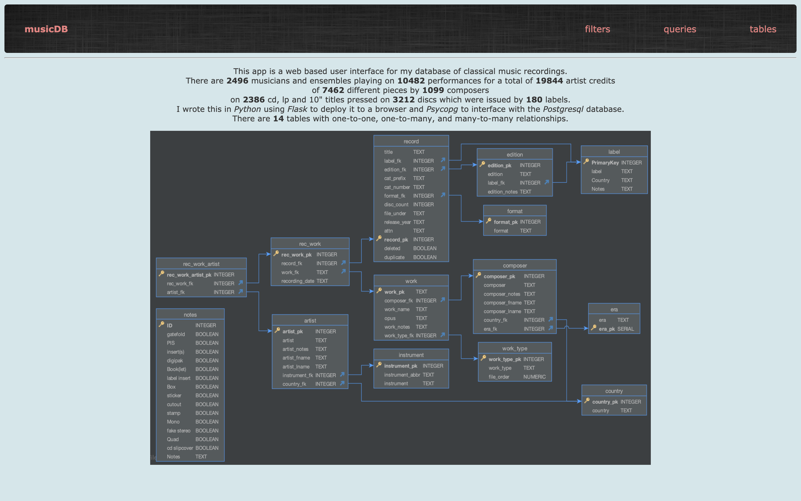
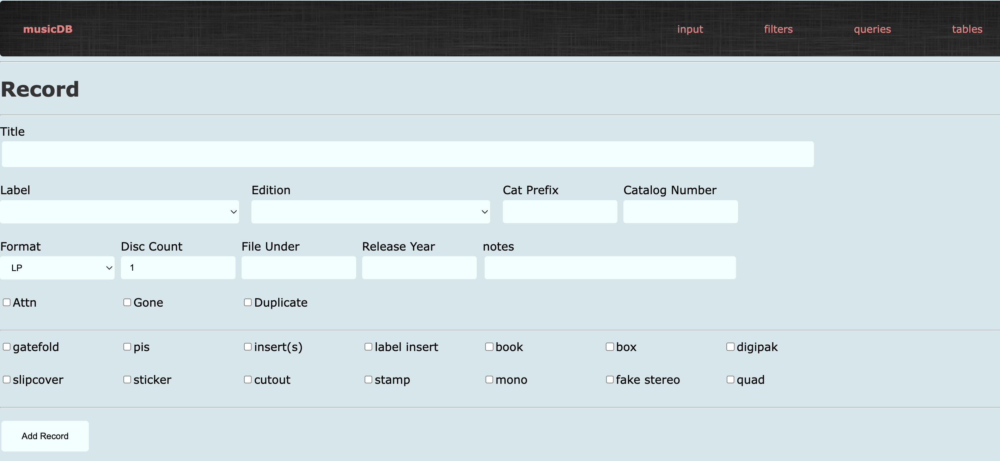
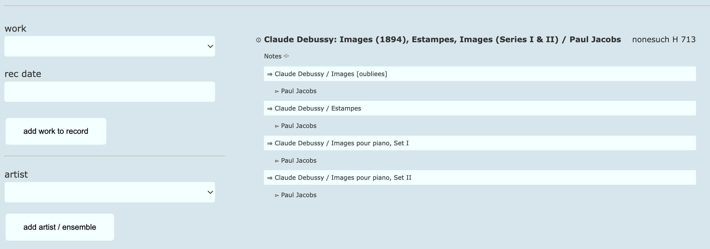
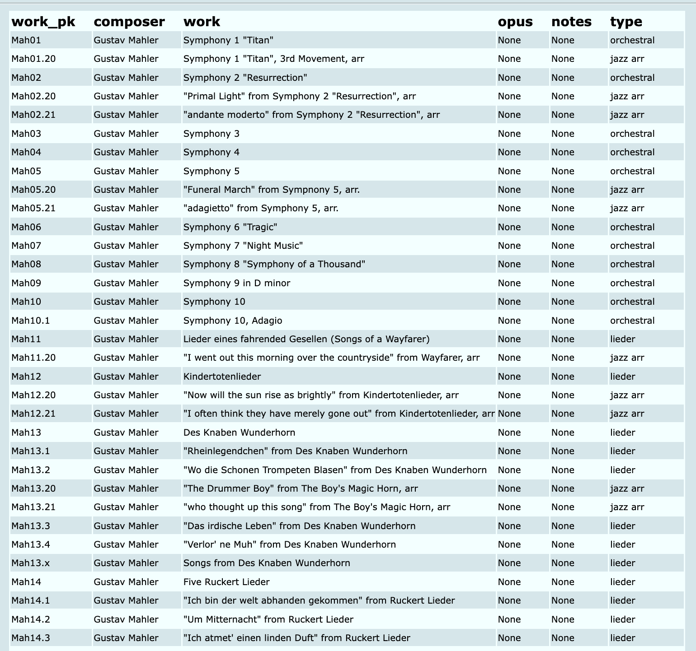
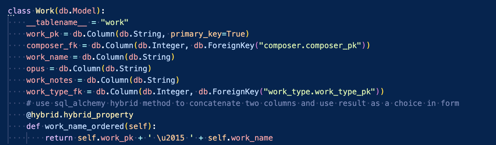

# My Personal Project: a database of classical music recordings

This is a web-based app I wrote in **Python** and **SQL** using **Flask** and **Psycopg** with **Postgresql** as a backend server and, of course, **HTML** on the front. There is some **Javascript** in the templates and I wrote all the *.css* style sheets with no downloaded framework like **Bootstrap**. The app is a user interface for my database of classical music recordings.  
On the home page I show an *Entity Relationship Diagaram* of the fourteen tables and a descriptive paragraph that includes live counts of rows in the database.

# Filter tab

Under the **Filter** tab, i can show records in the database in six ways. 
Here is a screenshot of the *titleWorkArtist* ordering of the data. The top line prints the title of the record on the left and the label, catalogue number, and the number and type of discs on the right. Below the title is a list of the different pieces on the record, showing the composer and name of the piece on the left and the type of work on the right. Below that is a list of the musicians who play on the piece on the left and the artist's role, instrument or type on the right. 

This *titleWorkArtist* view `SELECTS` data from ten of the fourteen tables which have to  be joined based on their key constraints using a `SQL` statement.  This statement is among all the other `SQL` statements in a **Python** `.py` file and pulled into the main `routes.py` file as a subroutine.

Because **Psycopg** retrieves data from the database in table form, I had to devise a way to display it in the above, easier to read format. In order to do this I wrote functions to loop through and seperate common data points like the record title first and musical work second then compiling a string with `html tags` which is then passed on to the template for the web page. All of these functions are saved on a separate **python** `.py `file and pulled into the main `routes.py` file as a subroutine. Here is a section of one of these functions. 

Back to the **Filter** tab, if i select *artistTitleWork*, i will get a list of names of all the artists in the database. The names as displayed are hyperlinks that will lead to the *artistTitleWork* view for that particular artist. The search box will narrow down the choices by entering any part of the artist's name in upper or lower case.

When I click on the link Anne-Sophie Mutter, I am showed a scrollable page with all the different works she plays ordered by type and alphabetically by composer.  On the beginning of her page, the violinist's chamber works are showed starting with those by Bartok. Under each work is printed the title information of whichever records i have in my collection.  You can see that I have three different records featuring Mutter playing Brahms's first violin sonata.

Back at the **Filter** tab, when I select *artistTitleWork* I will see the list of artists. When i click on one of the links, I see the arist's name and instrument again, but now i see a list of the records i have with them on it then a list of only the works that artist is featured on.  The Anne-Sophie Mutter page starts with an alphabetical list of all the titles she's featured on.

When I select *composerWorkArtist* from the **Filter** tab, I am taken to a list of composers which i can narrow down in the search box. Here is the beginning of JS Bach's page which shows a list of his works and the records I have featuring those pieces. This list is ordered by the type -- first, seen below, is piano pieces -- and then by opus number, starting in this case by BWV 543. 

If I scroll down, i see two recordings of one of the concertos Anne-Sophie Mutter plays on along with three other recordings I have of those pieces, two by Adolph Busch and one by David Oistrakh as soloist.

I also have available under the **Filters** tab a view called *composerTitleWork*. This shows a list of composers to choose, then record titles and the works featured on them. This list is sorted by the record's place on my shelves and features only the works by the composer selected. For example the first record to feature JS Bach on my list is called *Albinoni: Adagio / Mendelssohn, Mozart, Bach, Pachelbel, Beethoven / Marriner*. It features pieces by six composers but this view only shows the two by Bach.

Scrolling down, here is a view of some of the violin concertos we saw above.

The last important view I have written is that of titles by record label.  This view is useful to display all the titles i have of one label, ordered by catalog number. Again, I can select from a list and use a text box.

Here is the beginning of the CRI list.

# Input tab

Under the **Input** tab, i can enter data into the database.  The main table in this database is the *record* table as it links to all the other tables.  Under the Input tab I can enter new composers, artists, works and labels.  Most importantly I can add new records to the collection which includes the works played and the musicians playing on each work. 

This input form includes a *frame* that shows the work in progress as a check on accuracy and a place keeper on the entry. Below is the *record* input section that shows the *work* and *artist* forms and the current work in progress.       

# Master Filter

As I developed in input page using *Flask Forms* I decided to use dropdown boxes on a *Master Filter* page that would provide all the choices on one page. Because populating the dropdown boxes uses no *Javascript* it takes a small fraction of the time to communicate with the database. In this screenshot I have populated the three *SelectFields*. From this single page I now have access to *composerWorkTitle*, *composerTitleWork*, *aristWorkTitle*, *artistTitleWork* views and the *label* view.

I have added an additional view called *works by pk* to show the works of any chosen composer ordered by my own system of index naming. This view makes it easier to decide if I need to add a new work to the database or if it already exists. In this screenshot you can see a partial list of works by Mahler.

As I was learning to work with *Forms* I continued to use discreet `.py` scripts to avoid redundancy in my main script, `routes.py`. I also started writing classes to create objects that would make the operation more efficient.

The app also has two other tabs, **Queries** and **Tables**. I used these as stages in developement for reference while writing the more flexible **Filters** code. As I have been using the app I have found myself having to use my code editor or pgAdmin to run `SELECT` queries to find specific details. I am currently planning new views to streamline the data entry process. I am also considering writing pages to edit the database in case i need to make corrections or add data to exisitng records.

I have also written another app similar to this one for **Pop Records**, which includes anything that doesn't require notating composers, works and artists.  There are, therefore, no *many to many* tables required or any of the more complicated `JOIN` statements. It is a lot simpler and has proven to be very useful.

